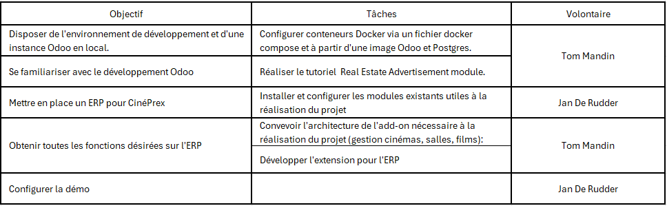

# ERP CinéPrex

Projet Information Systems

Auteurs

- Tom Mandin
- Jan De Rudder

## Utilisation

Ce projet utilise Docker.

Pour lancer l'ERP, placez vous à la racine du dépôt et faites:

    $ docker compose up -d

L'ERP est disponible à l'adresse `http://localhost:8069/` dans votre navigateur web.

Lors du premier lancement, vous devez configurer la base de données. Pour ce faire:

- allez à l'URL `http://localhost:8069/web/database/manager`
- choisissez `Restore Database`
- uploadez l'archive depuis le dépôt à l'emplacement `odoo-backup/cinema_latest.zip`

## Développement

### Planification du projet

### Import/export BDD

Utiliser la sauvegarde par fichier .zip du gestionnaire base de données à l'adresse http://localhost:8069/web/database/manager.

### Mise à jour liste applications

Si besoin de mettre à jour manuellement la liste des applications sur l'ERP:

- se connecter au conteneur odoo

    $ docker exec -it odoo-web sh

- mettre à jour l'appli cinéma

    $ odoo --db_host=odoo-db -u cinema -d odoo -w password

- alternativement, tout mettre à jour

    $ odoo --db_host=odoo-db -u all -d odoo -w password
